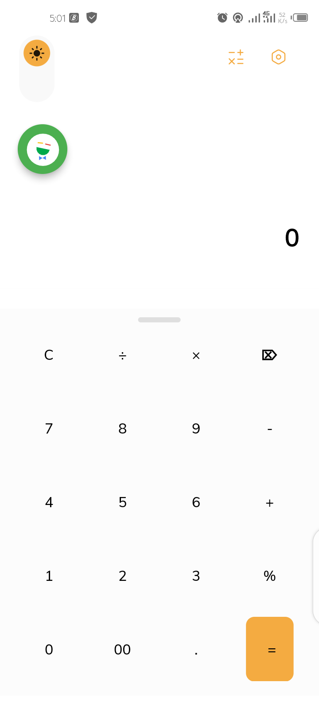
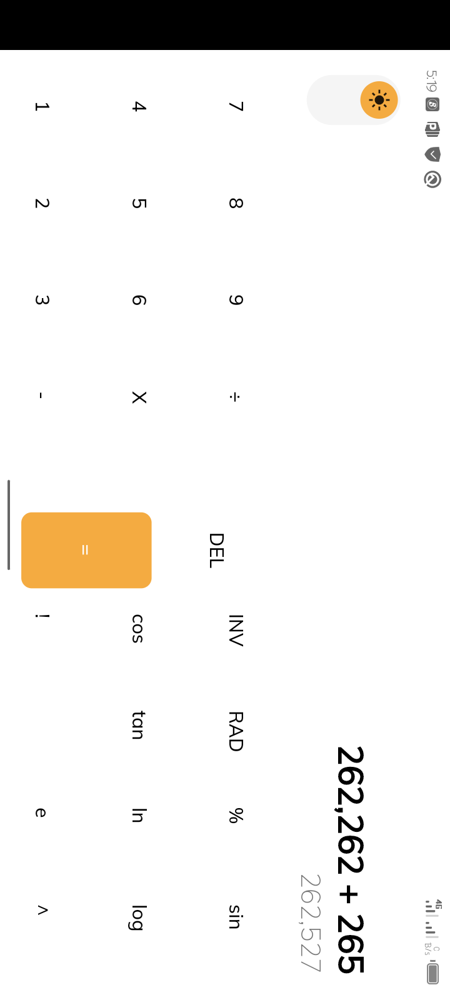
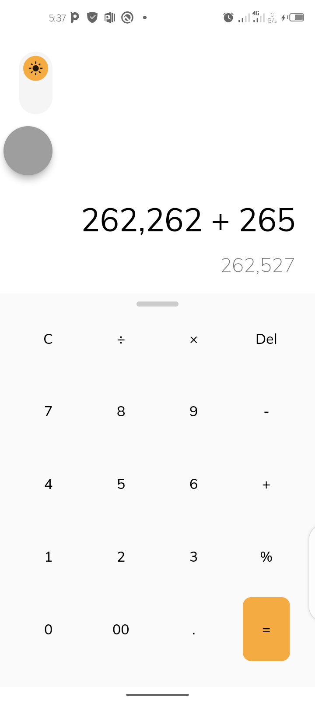

# Voice Calculator App 👋


[](#)

 <!--  -->

A Voice Calculator App built with Flutter

# Flutter Version

Flutter 1.22.4

# 💻 Requirements

- Any Operating System (ie. MacOS X, Linux, Windows)
- Any IDE with Flutter SDK installed (ie. IntelliJ, Android Studio, VSCode etc)
- A little knowledge of Dart and Flutter

# Screenshots






# Command

### Install dependencies

```sh
flutter pub get
```

### Run application

```sh
flutter emulators --launch <emulator_name>
flutter run
```

### Build

```sh
flutter build apk
```

# Plugins

- [google_font](https://pub.dev/packages/google_font)
- [flutter_bloc](https://pub.dev/packages/flutter_bloc)
- [flutter_icons](https://pub.dev/packages/flutter_icons)
- [sqflite](https://pub.dev/packages/sqflite)
- [path_provider](https://pub.dev/packages/path_provider)
- [shared_preferences](https://pub.dev/packages/shared_preferences)
- [flutter_screenutil](https://pub.dev/packages/flutter_screenutil)
- [url_launcher](https://pub.dev/packages/url_launcher)
- [lottie](https://pub.dev/packages/lottie)
- [math_expressions](https://pub.dev/packages/math_expressions)
- [speech_to_text](https://pub.dev/packages/speech_to_text)
- [iconsax](https://pub.dev/packages/iconsax)

# Features

- Light/Dark Theme
- Color Picker
- Potrait/ Landscape
- Voice Recognition
- History
- Animated Draggable Voice Assitance
- Basic Math Expression
- Reacts to Internet Status

# Coming Soon

- BMI Calculator
- Firebase ML Vision
- UI Updates

## Author

👤 **Adekunle Damilola Sunday**

- Github: [@Dammy Richie](https://github.com/ichie2)

## Contributors

- Github: [@Dammy Richie](https://github.com/ichie2)
